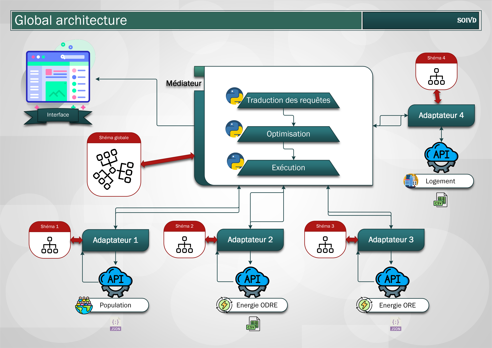
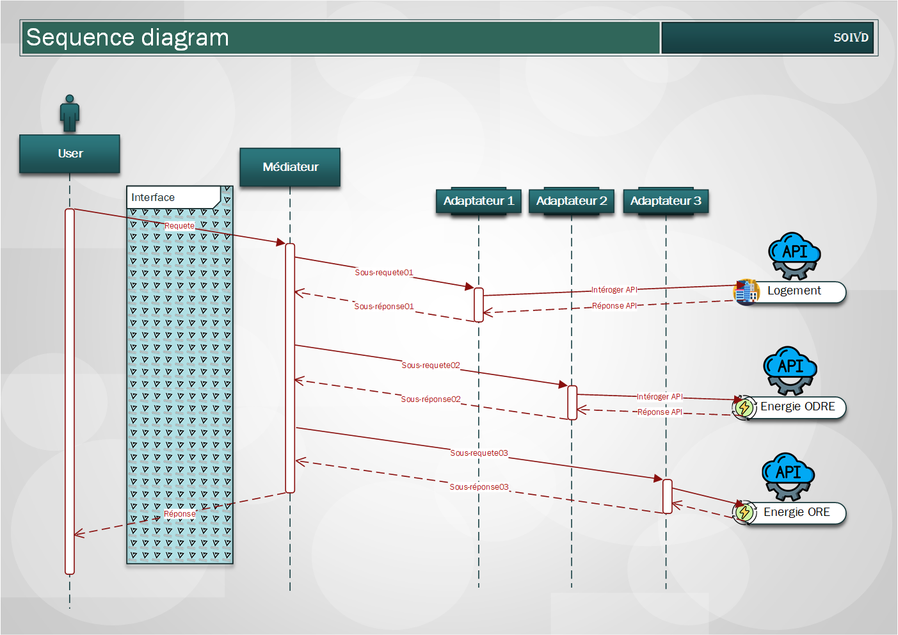

# Système  d’Intégration de Données


## le Projet
L'objectif de ce projet est de développer un Système d'Intégration Virtuelle de Données (SIVD) optimisé, qui tirera parti de diverses sources de données liées à l'énergie et aux conditions météorologique 
##### Contexte
● Intégration virtuelle de données provenant de diverses  origines.  

● Multiples  sources d’informations.   


● Exploration de l'architecture médiateur/adaptateur.

● Optimisation des requêtes et selection  de la méthode la plus performante.


##### solution apportée  
Une Application de fusion De Données virtuelle exploitant l'architecture médiateur-adaptateur.
##### Objectif
Consulter de manière cohérente des données multiples.

#### Outils
- Python
- Pandas (pandasql)
- APIs
- Flask
- HTML/CSS

## Installation

Use the package manager `pip` to install     
```bash
pip install -r requirements.txt
```
OR      

Use the package manager `pip` to install 

```bash
pip install flask
pip install pandasql
pip install contextlib
pip install bs4
pip install dateutil
```

## Packages

- json : https://docs.python.org/2/library/json.html

- requests : https://fr.python-requests.org/en/latest/

- dateutil : https://dateutil.readthedocs.io/en/stable/

- pandas : https://pandas.pydata.org/docs/

- pandasql : https://pypi.org/project/pandasql/

- termcolor : https://pypi.org/project/termcolor/

- urllib : https://docs.python.org/fr/3/library/urllib.html

- BeautifulSoup : https://www.crummy.com/software/BeautifulSoup/bs4/doc/

- contextlib : https://docs.python.org/3/library/contextlib.html

- flask : https://flask.palletsprojects.com/en/2.2.x/

## Conception
Figure répresentant l'architecture adoptée. 


Diagramme de séquence



## Datasets

Source de données: Nous utiliserons deux API fournissant des données sur l'utilisation du gaz et de l'électricité dans diverses régions, une autre pour les données démographiques en France, et une dernière pour les informations sur le logement en France.


## Mise en place de l'environnement Flask
 - Création d'un environnement virtuel soit avec anaconda soit avec la commande -m venv <environment name> sous python
 - Dans le cas où l'env virtuel est crée par Anaconda, il faut spécifier dans le anaconda prompt : conda activate <environment name>
 - Pointer sur le dossier api_flask  (./api_flask)
 - Installer les bibliothèques nécessaires dans le fichier requirements.txt (Flask, requests, json, ...)
#### Exécution de l'app Flask
 - Dans la commande prompt d'anaconda : 
     1) set FLASK_APP=app.py
     2) set FLASK_ENV=development
     3) flask run
 - Taper dans l'url :  http://127.0.0.1:5000/
 - Obtenir les résultats affichés dans la page web
 

## Références:
- [1] S. A. Y. P. V. S. S. Adah, «Query Caching and Optimization in Distributed Mediator Systems,» SIGMOD, p. 12, 1996.
- [2] A. H. G. M. W.-C. T. Behzad Golshan, «Data Integration: After the Teenage Years,» PODS’17, p. 6, 2017.
- [3] P. K. P. S. G. A. A. J. R. B. S. D. G. H. L. P. M. S. M. E. P. H. Z. AnHai Doan, «Toward a System Building Agenda for Data Integration (and Data Science),» IEEE, p. 12.
- [4] G. Wiederhold, «Mediators in the Architecture of Future Information Systems,» IEEE, p. 38, 1991.
- [5] Api logements: https://opendata.caissedesdepots.fr/pages/pagehomerefonte/ 
- [6] Api energie 1 : https://opendata.agenceore.fr/explore/dataset/conso-elec-gaz-annuelle-par-secteur-dactivite-agregee-epci/information/ 
- [7] Api energie 2 : https://odre.opendatasoft.com/explore/dataset/conso-epci-annuelle/ 
- [8] Api population : https://public.opendatasoft.com/explore/dataset/population-francaise-communes/ 
- [9] Flask framework : https://flask.palletsprojects.com/en/2.2.x/ 
- [10] Anaconda distribution : https://docs.anaconda.com/anaconda/ 


